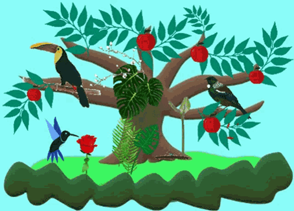

# Listen To The Wild 🐦

## About 💁

The analysis of massive datasets of soundscapes presents a challenge to **ecologists**. This project aims to **develop a method for predicting the naturalness of ecosystems** and their **richness** based on **acoustic indices**. To achieve this, we will combine multiple acoustic indices, employ **unsupervised** and **supervised classification** methods, and use **regression** to **predict the naturalness** of a territory. This project will highlight the relationships between acoustic indices and environmental characteristics, with the goal of developing tools for biodiversity and environmental monitoring.

  

---

### Ressources 🛄

Here are some useful resources related to this project:

<!-- * [Extended abstract](https://docs.google.com/document/d/186gmrj6DYE0ezmFN2C1-FuwIkbqe1W02XiS_HEMDdE4/edit?usp=share_link) - This document provides an in-depth overview of the project, including methodology, results, and conclusions. It's an essential resource for those interested in the details of our research. -->
<!-- * [Presentation slides](https://docs.google.com/presentation/d/1gOhZ1y7yEcw4CYJFGzokNKopnkgIZHYBvke3DvMuxQM/edit?usp=share_link) - We created a set of slides summarizing the key aspects of our project. These slides are an excellent resource for those who want a quick and easy way to understand the project's main points. -->

[> Related Work](./ressources/ListenToTheWild-Etude-bibliographique.pdf) : This approach summarizes the attempts that are being undertaken, taking into account related works and builds upon a comprehensive literature review. It seeks to contribute to the existing body of knowledge by addressing the specific challenges posed by the analysis of massive datasets of soundscapes in ecological research. 

We hope these resources will be helpful to those interested in learning more about our project.

  

<!--  -->

### Technologies 🧑‍💻

* [Python - matplotlib, pandas, seaborn, numpy, cartopy]()
* [TensorFlow](https://www.tensorflow.org/)
* [Keras](https://keras.io/)
* [scikit-learn](https://scikit-learn.org/stable/)

---

## Repository 🛅

This repository offers an extensive collection of code and data designed to address various project tasks. It includes classifiers, regressors. The following section delineates the intended purposes of the different files within the repository:

- [supervise](https://github.com/jramassa/ListenToTheWild/tree/main/supervise)
    -  [classification of blue/red estive/lisiere](https://github.com/jramassa/ListenToTheWild/tree/main/supervise/classification)
        - [classification_par_site](https://github.com/jramassa/ListenToTheWild/tree/main/supervise/classification/classification_par_site)
            - [classification_par_site.ipynb](https://github.com/jramassa/ListenToTheWild/blob/main/supervise/classification/classification_par_site/classification_par_site.ipynb) : Classification by creating a classifier per site and temporal segregation to form train and test sets (training on records belonging to the first n-1 days of the site and testing on records belonging to the last day of the site) using scikit-maad acoustic indices.
            - [cross_validation_2_classifiers_par_site.ipynb](https://github.com/jramassa/ListenToTheWild/blob/main/supervise/classification/classification_par_site/cross_validation_2_classifiers_par_site.ipynb) : Same as [cross_validation_par_site.ipynb](https://github.com/jramassa/ListenToTheWild/blob/main/supervise/classification/classification_par_site/cross_validation_par_site.ipynb) but with one classifier for the "Position" and another for the "Dynamique".
            - [cross_validation_par_site.ipynb](https://github.com/jramassa/ListenToTheWild/blob/main/supervise/classification/classification_par_site/cross_validation_par_site.ipynb) : Same as [classification_par_site.ipynb](https://github.com/jramassa/ListenToTheWild/blob/main/supervise/classification/classification_par_site/classification_par_site.ipynb) but with cross validation.
            - [vggish_classification_par_site.ipynb](https://github.com/jramassa/ListenToTheWild/blob/main/supervise/classification/classification_par_site/vggish_classification_par_site.ipynb) : Classification by creating a classifier per site and temporal segregation to form train and test sets (training on records belonging to the first n-1 days of the site and testing on records belonging to the last day of the site) using VGGish acoustic indices.
            - [vggish_cross_validation_2_classifiers_par_site.ipynb](https://github.com/jramassa/ListenToTheWild/blob/main/supervise/classification/classification_par_site/vggish_cross_validation_2_classifiers_par_site.ipynb) : Same as [vggish_cross_validation_par_site.ipynb](https://github.com/jramassa/ListenToTheWild/blob/main/supervise/classification/classification_par_site/vggish_cross_validation_par_site.ipynb) but with one classifier for the "Position" and another for the "Dynamique".
            - [vggish_cross_validation_par_site.ipynb](https://github.com/jramassa/ListenToTheWild/blob/main/supervise/classification/classification_par_site/vggish_cross_validation_par_site.ipynb) : Same as [vggish_classification_par_site.ipynb](https://github.com/jramassa/ListenToTheWild/blob/main/supervise/classification/classification_par_site/vggish_classification_par_site.ipynb) but with cross validation.
        - [hyperparameter_tuning](https://github.com/jramassa/ListenToTheWild/tree/main/supervise/classification/hyperparameter_tuning)
            - [optimisation_modele_random_forest.ipynb](https://github.com/jramassa/ListenToTheWild/blob/main/supervise/classification/hyperparameter_tuning/optimisation_modele_random_forest.ipynb) : Hyperparameter tuning on Random Forest in order to get the best parameters for the classification but we observe that the results take too many time and was fastidious.
        - [classification_cross_validation.ipynb](https://github.com/jramassa/ListenToTheWild/blob/main/supervise/classification/classification_cross_validation.ipynb) : Temporal segregation (We divide the day into time slots and train on the majority of the time slot, then test on the remainder) and spatial segregation (We divide the data into sites and train on the n-1 sites, then test on the 1 remaining site) using scikit-maad acoustic indices.
        - [classification_day_temporal.ipynb](https://github.com/jramassa/ListenToTheWild/blob/main/supervise/classification/classification_day_temporal.ipynb) :  We train on the initial days and test on the final days using scikit-maad acoustic indices.
        - [classifying_position_dynamique_in_a_single_site.ipynb](https://github.com/jramassa/ListenToTheWild/blob/main/supervise/classification/classifying_position_dynamique_in_a_single_site.ipynb) : Classification on Antras Isard site using Random Forest and XGBoost, after the feature selection.
        - [random_forest_onehot_encoding.ipynb](https://github.com/jramassa/ListenToTheWild/blob/main/supervise/classification/random_forest_onehot_encoding.ipynb) : Classification using one hot encoding for the label (instead of 1,2,3,4) and we observe that using one-hot encoding was not relevant.
        - [vggish_classification_cross_validation.ipynb](https://github.com/jramassa/ListenToTheWild/blob/main/supervise/classification/vggish_classification_cross_validation.ipynb) : Temporal segregation (We divide the day into time slots and train on the majority of the time slot, then test on the remainder) and spatial segregation (We divide the data into sites and train on the n-1 sites, then test on the 1 remaining site) using VGGish acoustic indices.
        - [vggish_classification_day_temporal.ipynb](https://github.com/jramassa/ListenToTheWild/blob/main/supervise/classification/vggish_classification_day_temporal.ipynb):  We train on the initial days and test on the final days using VGGish acoustic indices.
    -  [regression](https://github.com/jramassa/ListenToTheWild/tree/main/supervise/regression)
        - [Regression de la longitude.ipynb](https://github.com/jramassa/ListenToTheWild/blob/main/supervise/regression/Regression%20de%20la%20longitude.ipynb) : Regression of the longitude using scikit-maad acoustic indices and VGGish acoustic indices with different models (MultiLayer Perceptron (MLP), Gradient Boosting, and Random Forest), after considering a feature selection.
        -  [Regression_Random_Forest.ipynb](https://github.com/jramassa/ListenToTheWild/blob/main/supervise/regression/Regression_Random_Forest.ipynb) :  Prediction of one acoustic index (scikit-maad) using the other acoustic indices, with Random Forest, not normalized.  
        - [Regression_Random_Forest_normalized.ipynb](https://github.com/jramassa/ListenToTheWild/blob/main/supervise/regression/Regression_Random_Forest_normalized.ipynb) : Prediction of one acoustic index (scikit-maad) using the other acoustic indices, with Random Forest normalized.
        - [Regression_de_la_longitude_erreur_relative.ipynb](https://github.com/jramassa/ListenToTheWild/blob/main/supervise/regression/Regression_de_la_longitude_erreur_relative.ipynb) : Regression of the longitude using scikit-maad acoustic indices and VGGish acoustic indices with different models (MultiLayer Perceptron (MLP), Gradient Boosting, and Random Forest), after considering a feature selection and using a relative error.
        - [regression_habitat_vggish.ipynb](https://github.com/jramassa/ListenToTheWild/blob/main/supervise/regression/regression_habitat_vggish.ipynb) : Prediction of the naturalness criteria (total_edge_length, shannon, grass_cover, ...) on numerous models (XGBoost, MultiLayer Perceptron (MLP), Random Forest) with feature importance (for the prediction), in order to determine the most relevant features, using VGGish acoustic indices.
        - [regression_habitat.ipynb](https://github.com/jramassa/ListenToTheWild/blob/main/supervise/regression/regression_habitat.ipynb) :  Prediction of the naturalness criteria (total_edge_length, shannon, grass_cover, ...) on numerous models (XGBoost, MultiLayer Perceptron (MLP), Random Forest) with feature importance (for the prediction), in order to determine the most relevant features, using scikit-maad acoustic indices.
        - [regression_indices_acoustiques.ipynb](https://github.com/jramassa/ListenToTheWild/blob/main/supervise/regression/regression_indices_acoustiques.ipynb) : Prediction of one acoustic index (scikit-maad) using the other acoustic indices.
        - [regression_creneau_horaire_habitat](https://github.com/jramassa/ListenToTheWild/blob/main/supervise/regression/regression_creneau_horaire_habitat.ipynb) : Initially, we employ multivariable models to forecast naturalness criteria during each time slot. Subsequently, univariate models are applied for each naturalness criterion, assessed based on the preceding time slot. This includes an overview of relative errors and corresponding plots.
- [non_supervise](https://github.com/jramassa/ListenToTheWild/tree/main/non_supervise)
    - [Cartographie_naturalness_par_layer_par_rayon.ipynb](https://github.com/jramassa/ListenToTheWild/blob/main/non_supervise/Cartographie_naturalness_par_layer_par_rayon.ipynb) : Unsupervised analysis (PCA, tSNE, and uMAP) per layer (1, 2, 3, and 4) and per radius (100, 250, 500, and 1000) of the naturalness. For the visualization part, we did different approaches. The first one, where we color the PCA, tSNE, uMAP based on `Transect` feature. The other one, where the color were based on `Position` and `Dynamique` features (using a feature `target` (00, 01, 10, and 11 (more detail on the .ipynb))). 
    - [Cartographie_naturalness.ipynb](https://github.com/jramassa/ListenToTheWild/blob/main/non_supervise/Cartographie_naturalness.ipynb) : Unsupervised analysis (PCA, tSNE, and uMAP) per radius (``100``, ``250``, ``500``, and ``1000``) of the naturalness. For the visualization part, we tried a k-means method.
    - [Concatenation_par_site_L_E_B_R.ipynb](https://github.com/jramassa/ListenToTheWild/blob/main/non_supervise/Concatenation_par_site_L_E_B_R.ipynb) : Concatenation for each site of scikit-maad and VGGish acoustic indices and also adding two columns ``Dynamique`` and ``Position``.
    - [googlecolab_scitkit_maad_analyse_non_supervise.ipynb](https://github.com/jramassa/ListenToTheWild/blob/main/non_supervise/googlecolab_scitkit_maad_analyse_non_supervise.ipynb) : Unsupervised analysis (PCA, tSNE, and uMAP) of one site, with the visualization of the PCA, tSNE, and uMAP on a map of the South of France and using Google colab platform.
    - [habitat_composition_cluster.ipynb](https://github.com/jramassa/ListenToTheWild/blob/main/non_supervise/habitat_composition_cluster.ipynb) : Unsupervised analysis (PCA, tSNE, and uMAP) for [habitat_composition_by_station.csv](https://github.com/jramassa/ListenToTheWild/blob/main/Donnees/Valeurs_acoustiques__naturalite__composition_habitat/habitat_composition_by_station.csv). For the visualization part, we had used k-means and agglomerative clustering methods in a map of the south of France. 
    - [non_supervise_naturalness.ipynb](https://github.com/jramassa/ListenToTheWild/blob/main/non_supervise/non_supervise_naturalness.ipynb) : Unsupervised analysis (PCA, tSNE, and uMAP) of [naturalness_index_by_site.csv](https://github.com/jramassa/ListenToTheWild/blob/main/Donnees/Valeurs_acoustiques_naturalite_composition_habitat_modified_Kawtar/naturalness_index_by_site.csv). For the visualization part, we had used a k-means method.
    - [PL_Analyse_non_supervise.ipynb](https://github.com/jramassa/ListenToTheWild/blob/main/non_supervise/PL_Analyse_non_supervise.ipynb) : Unsupervised analysis (PCA, tSNE, and uMAP) of [habitat_composition_by_station.csv](https://github.com/jramassa/ListenToTheWild/blob/main/Donnees/Valeurs_acoustiques__naturalite__composition_habitat/naturalness_index_by_site.csv) using 10 clustering methods such like (k-means, k-medoids, HDBSCAN, DBSCAN, Agglomerative clustering, etc,...)
    - [Scikit_maad_indices_acoustic_analyse_non_supervisee.ipynb](https://github.com/jramassa/ListenToTheWild/blob/main/non_supervise/Scikit_maad_indices_acoustic_analyse_non_supervisee.ipynb) : Unsupervised analysis (PCA, tSNE, and uMAP) of [concatenated_acoustic_indices.csv]() merged with [habitat_composition_by_station.csv](https://github.com/jramassa/ListenToTheWild/blob/main/Donnees/Valeurs_acoustiques__naturalite__composition_habitat/habitat_composition_by_station.csv) for the visualization (need of ``LONGITUDE`` and ``LATITUDE``) on the map of the south of France.
    - [Unsupervised_analysis_per_Antras_Isard_2022_L_E_B_R.ipynb](https://github.com/jramassa/ListenToTheWild/blob/main/non_supervise/Unsupervised_analysis_per_Antras_Isard_2022_L_E_B_R.ipynb) : Unsupervised analysis (PCA, tSNE, and uMAP) of Antras Isard site acoustic indices. The visualization is based on L E B R which stands for Lisiere, Estive, Bleu et Rouge. 
    - [Unsupervised_analysis_per_site_L_E_B_R.ipynb](https://github.com/jramassa/ListenToTheWild/blob/main/non_supervise/Unsupervised_analysis_per_site_L_E_B_R.ipynb) : Unsupervised analysis (PCA, tSNE, and uMAP) of each site acoustic indices. The visualization is based on L E B R which stands for Lisiere, Estive, Bleu et Rouge. 
    - [vggish_indices_acoustic_analyse_non_supervisee.ipynb](https://github.com/jramassa/ListenToTheWild/blob/main/non_supervise/vggish_indices_acoustic_analyse_non_supervisee.ipynb) : Unsupervised analysis (PCA, tSNE, and uMAP) of [concatenated_VGGish_acoustic_indices.csv]() merged with [habitat_composition_by_station.csv](https://github.com/jramassa/ListenToTheWild/blob/main/Donnees/Valeurs_acoustiques__naturalite__composition_habitat/habitat_composition_by_station.csv) for the visualization (need of ``LONGITUDE`` and ``LATITUDE``) on the map of the south of France.
    - [VGGish_Unsupervised_analysis_per_Antras_Isard_2022_L_E_B_R.ipynb.ipynb](https://github.com/jramassa/ListenToTheWild/blob/main/non_supervise/VGGish_Unsupervised_analysis_per_Antras_Isard_2022_L_E_B_R.ipynb) : Unsupervised analysis (PCA, tSNE, and uMAP) of Antras Isard site VGGish acoustic indices. The visualization is based on L E B R which stands for Lisiere, Estive, Bleu et Rouge.  
    - [VGGish_Unsupervised_analysis_per_site_L_E_B_R.ipynb](https://github.com/jramassa/ListenToTheWild/blob/main/non_supervise/VGGish_Unsupervised_analysis_per_site_L_E_B_R.ipynb) : Unsupervised analysis (PCA, tSNE, and uMAP) of each site VGGish acoustic indices. The visualization is based on L E B R which stands for Lisiere, Estive, Bleu et Rouge.
    - [Temporal_Unsupervised_analysis_for_each_site.ipynb](https://github.com/jramassa/ListenToTheWild/blob/main/non_supervise/Temporal_Unsupervised_analysis_for_each_site.ipynb) : Unsupervised analaysis (PCA, tSNE, and uMAP) of each site, in each Dynamique, and each Position. Regarding visualization, we incorporate the temporal dimension by assigning varying shades of color corresponding to the hours (and minutes) present in the data.  
- [PANNs_inference](https://github.com/jramassa/ListenToTheWild/tree/main/PANNs_inference)
    - [class_labels_indices.csv](https://github.com/jramassa/ListenToTheWild/blob/main/PANNs_inference/class_labels_indices.csv) : where we have the different sound classes made by [panns_inference by qiuqiangkong](https://github.com/qiuqiangkong/panns_inference)
    - [panns_inference_on_mean_file_audios](https://github.com/jramassa/ListenToTheWild/blob/main/PANNs_inference/panns_inference_on_mean_file_audios.ipynb):where we generated bar and pie charts for sites exhibiting the highest and lowest mean naturalness, we've also developed a function that enables the comparison of these sites in a single bar plot, complete with a 95% confidence interval (using bootstraping).
---

## How to start ? 🚨

Kindly be aware that the code has been crafted with maximum flexibility in mind. Nevertheless, there's a possibility that you may need to customize it to suit your particular use case and circumstances.

---

### Requirement 🔑

All notebooks have been developed for use in [Google Colab](https://colab.research.google.com/), and Python files are also coded to complement these notebooks. You can effortlessly employ them in this environment, ensuring smooth execution of the provided code.

---

### Usage 🔧

#### > Manipulating Data 

In order to do the different classification and regresssion tasks, we had used pandas and os library, creating csv files based on the data that we have. 

You can explore example outputs in the following files: [concatenated_acoustic_indices.csv](https://github.com/amarmeddahi/sounds-of-nature/blob/main/data/indices.csv) (resulting from the concatenation of scikit-maad acoustic indices CSV files from all sites, including a new "Year" column for 2022 and 2023) or [concatenated_VGGish_acoustic_indices.csv](https://github.com/amarmeddahi/sounds-of-nature/blob/main/data/indices.csv) (resulting from the concatenation of VGGish acoustic indices CSV files from all sites, also with a new "Year" column for 2022 and 2023). These files are particularly valuable for predicting longitude and comparing the two approaches, VGGish versus scikit-maad.

---
#### > Soundscape Analysis

In the classification process, we conducted a comprehensive analysis involving four classes (`bleu estive`, `bleu lisiere`, `rouge estive`, and `rouge lisiere`) utilizing unsupervised techniques such as PCA, tSNE, and uMAP.

Our unsupervised analysis visualization was twofold – first, based on the `Transect` feature, a combination of `Commune`, `LID`, and `Dynamique`, and second, based on the temporal aspect (`time`).

To gauge the significance of features, we employed Random Forest, MultiLayer Perceptron (MLP), and Gradient Boosting.

For the analysis of [habitat_composition_by_station.csv]() and [naturalness_index_by_site.csv](), we employed PCA, tSNE, and uMAP, generating visualizations on a map of the southern region of France using the Cartopy library in Python.

Similarly, we conducted visualizations after applying PCA, tSNE, and uMAP to the concatenated file of scikit-maad acoustic indices from all sites, as well as another visualization for VGGish acoustic indices. Both were mapped onto the southern region of France for spatial representation.

---

#### > Biodiversty Data Regression

We conducted a regression analysis of naturalness metrics, including `LONGITUDE`, `LATITUDE`, `SHANNON_LANDSCAPE_DIVERSITY`, etc., utilizing scikit-maad acoustic indices. A parallel regression was performed using VGGish acoustic indices to facilitate a comparative analysis of the two approaches. This analysis was conducted employing the scikit-learn library, utilizing algorithms such as Random Forest, MultiLayer Perceptron (MLP), and XGBoost. Cross-validation techniques were applied for data validation, incorporating both temporal and spatial segregation. Hyperparameter tuning was performed to enhance the model's performance.

Following feature selection, we proceeded with a regression analysis of one acoustic index based on the other acoustic indices.

## Contact 📩

- yasmine [dot] charifi [at] etu [dot] toulouse-inp [dot] com
- bryan [dot] chen [at] etu [dot] toulouse-inp [dot] com
- jonas [dot] lavaur [at] etu [dot] toulouse-inp [dot] com
- kawtar [dot] lyamoudi [at] etu [dot] toulouse-inp [dot] com
- jordan [dot] ramassamymoutoussamy [at] etu [dot] toulouse-inp [dot] com

## Acknowledgments 🤗

A big thanks to our supervisors:

- **Maxime Cauchoix**, Research Scientist, SETE, LEFE, CNRS. 
- **Axel Carlier**, Assistant Professor, Toulouse INP, IRIT.

And the last year group members of ENSEEIHT, Toulouse INP: 

- Amar Meddahi
- Edgar Remy
- Fabio Pereira de Araujo
- Linda Hammami
- Sarah Chougar
- Younes Boutiyarzist
 
**Listen To The Wild** communicates with and/or references the following:

- [scikit‐maad](https://github.com/scikit-maad/scikit-maad)
- [cartopy]()
- [nextcloud]()
- [uicn]()

We express our gratitude to all their contributors and maintainers!
